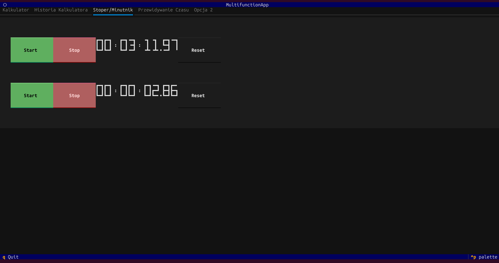
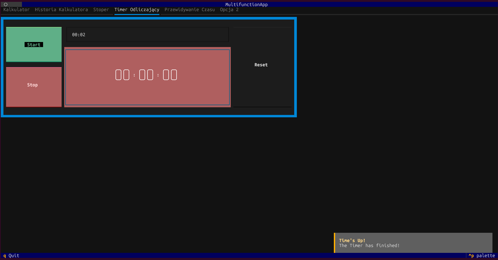
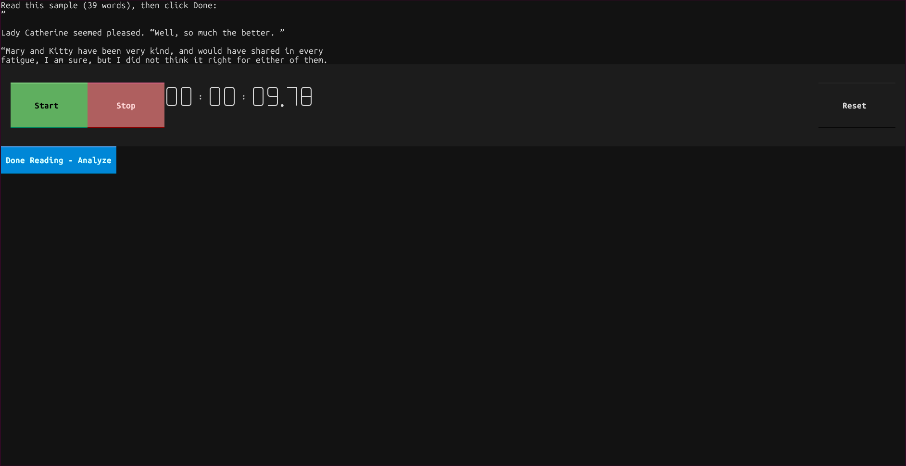
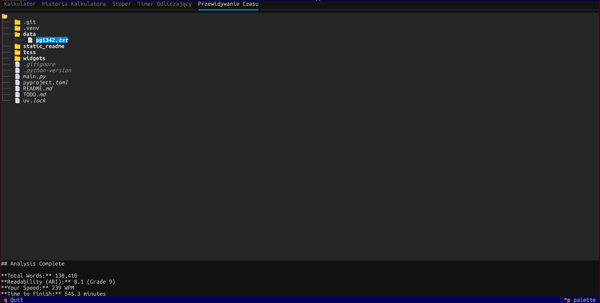

Program komunikuje się z użytkownikiem w języku [Polglisz](https://pl.wikipedia.org/wiki/Polglisz) z użyciem metody [jako tako](https://wsjp.pl/haslo/podglad/30247/jako-tako)

Tekst przedstawiony w analizie to [Pride and Prejudice by Jane Austen](https://www.gutenberg.org/ebooks/1342)

## Instrukcje Uruchomienia

Instalacja uv: https://docs.astral.sh/uv/getting-started/installation/

```uv sync```

```uv run textual run --dev main.py```


## AI

Tworzenie aplikacji było wspierane modelami Gemini 3.0 Pro oraz Gemini 3.0 Flash.
Przede wszystkim do generowania kodu .tcss

## Funkcje Podstawowe

### Kalkulator

Kalkulator bazowany na [przykładzie](https://github.com/Textualize/textual/blob/main/examples/calculator.py) zmiany wprowadzone w przykładzie:

* Dodanie historii ostatnich działań lewym górnym rogu kalkulatora 
* Dodanie taba historia kalkulatora 

### Timer/Stopwatch

Bazowany na tutorialu: https://textual.textualize.io/tutorial/#get-the-code


Timer wraz z powiadomieniem o końcu czasu dostępny na osobnym tabie: 

### Przewidywanie czasu potrzebnego na przeczytanie tekstu z pliku

Aplikacja zawiera directory tree za pomocą którego wybieramy plik do analizy, następnie następuje pokazanie ekranu z stoperem który należy uruchomić i potem zastopować po przeczytaniu tekstu


Po przeprowadzeniu analizy i wczytaniu tekstu uzyskamy wyświetlający się na dole ekranu wynik


## Funkcje Dodatkowe

### TUI

Aplikacja została stworzona przy użyciu biblioteki https://textual.textualize.io/

### Historia Kalkulatora

Wcześniej wspomniana kalkulator został rozwinięty o funkcjonalość przechowywania historii

### Liczenie ARI

Skrypt analizy czasu potrzebnego na przeczytanie pliku zwraca również wynik testu poziomu [Automated readability index (ARI)](https://en.wikipedia.org/wiki/Automated_readability_index)
