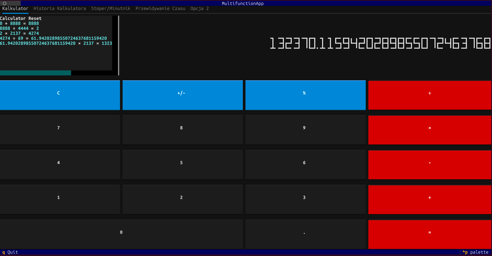
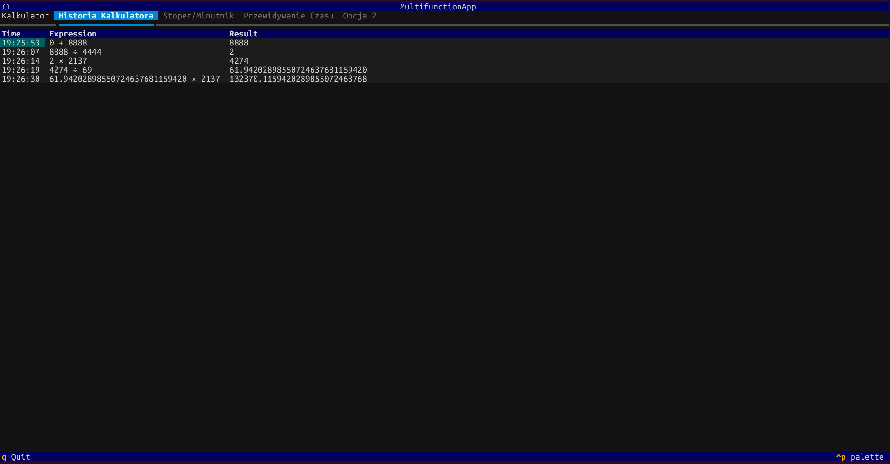

## Kalkulator

Kalkulator bazowany na [przykładzie](https://github.com/Textualize/textual/blob/main/examples/calculator.py) zmiany wprowadzone w przykładzie:

* Dodanie historii ostatnich działań lewym górnym rogu kalkulatora 
* Dodanie taba historia kalkulatora 

## Funkcje Dodatkowe

### TUI

Aplikacja została stworzona przy użyciu biblioteki https://textual.textualize.io/

### Historia Kalkulatora

Wcześniej wspomniana kalkulator został rozwinięty o funkcjonalość przechowywania historii